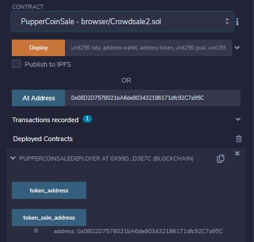

# Crowdsale_Contract_Using_OpenZeppelin
A crypto token crowdsale using smart contracts and the OpenZeppelin Solidity library. The crowdsale in this example is capped at raising 25 ETH and will run for 5 minutes.

This crowdsale contract manages the entire process allowing users to send ETH and get back PUP (PupperCoin). This contract will mint the tokens automatically and distribute them to buyers in one transaction.

---

## Process for Purchasing PupperCoin

Compile the `Crowdsale.sol` file. This will import the libraries at the top.

Select PupperCoinSaleDeployer in the contract dropdown.

Fill in the name, symbol, funding wallet address, and funding goal. Click transact to deploy the contract. Confirm the transaction when the MetaMask pops open.

PupperCoinSaleDeployer should apper in the Deployed Contracts sections. Click the `token_sale_address` button and copy the address. Paste the address above in the `At Address` field. Next select `PupperCoinSale` in the contract dropdown. Now click `At Adress`. 

A newly deployed contract named PupperCoinSale should appear. Go back to PupperCoinSaleDeployer and click the `token_address` button and copy the address. Paste the address above in the `At Address` field. Next select `PupperCoin` in the contract dropdown. Now click `At Adress`. A new deployed contract named PupperCoin should appear.

Point MetaMask to a different address.

Add a value and unit of account, for example 25 ether. Insert the benficiary address and click transact to buy PupperCoin tokens! 

